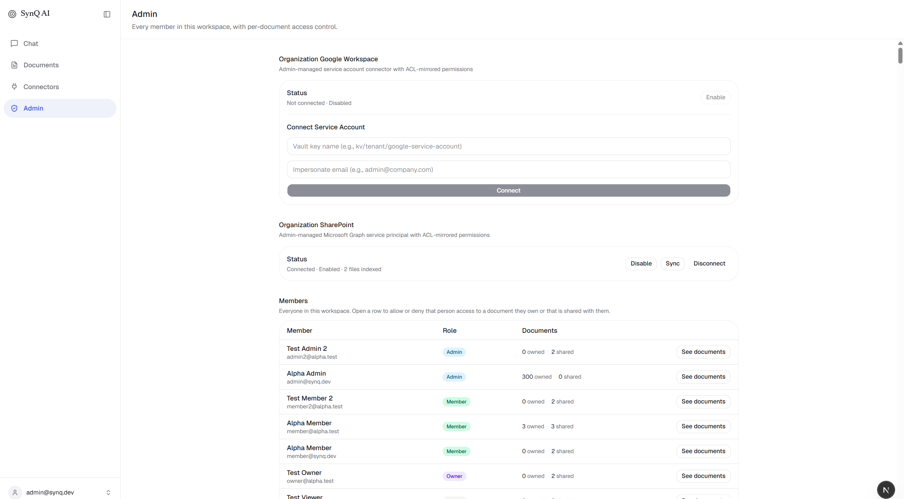
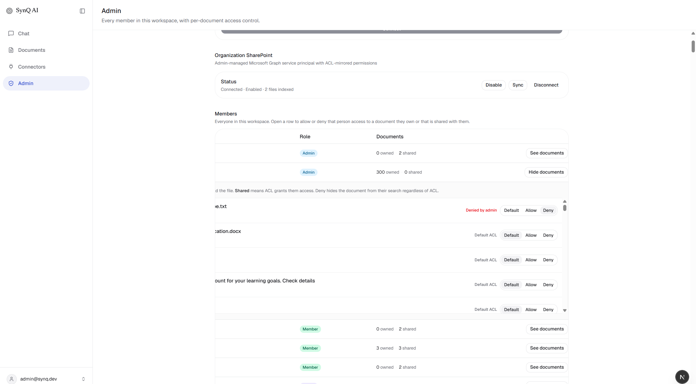
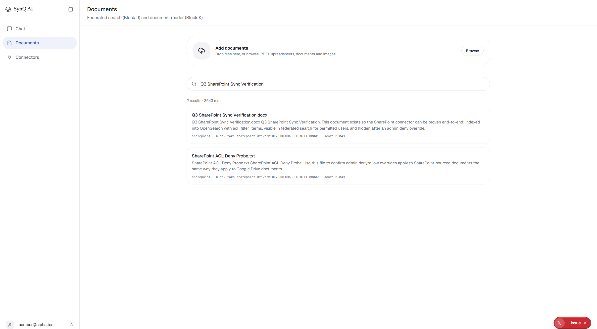
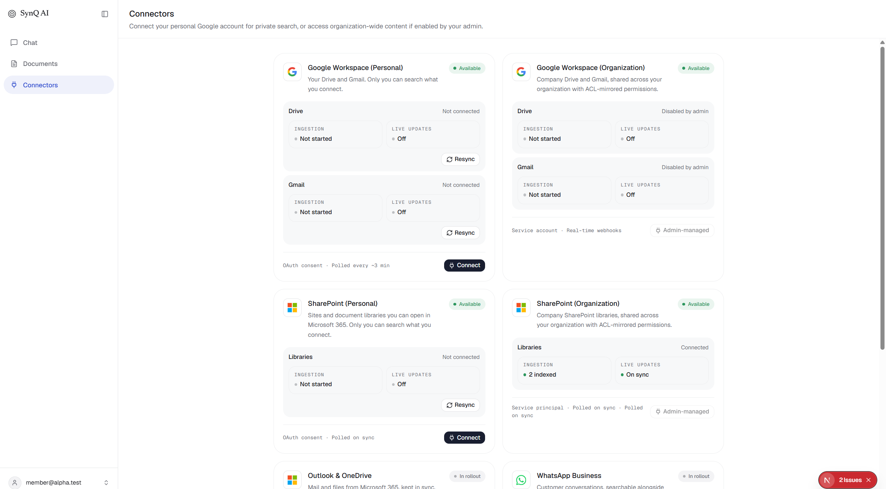

# SharePoint Connector Verification Report

Recorded 2026-09-03. This is not a self-graded PASS. It states what was observed in APIs, OpenSearch, Celery logs, and a real browser session at `http://localhost:3000`.

Integration surface: **Microsoft Graph** (`https://graph.microsoft.com/v1.0`), not SharePoint REST.

Org auth: **Azure AD client-credentials (service principal)**, matching Google’s admin-managed service account. Personal connector: delegated Graph OAuth (Connect button on `/connectors`; not exercised against a live Azure app in this session).

---

## Click paths (what you can repeat)

### Admin

1. Open `http://localhost:3000/login`.
2. Sign in as `admin@synq.dev` / `AlphaAdmin123!` (workspace `alpha`).
3. Open **Admin**.
4. **Organization SharePoint** card: status should read **Connected · Enabled · 2 files indexed**. Buttons: Disable, Sync, Disconnect.
5. If not connected: paste vault key `kv/tenant/dev-fake-sharepoint-app` → **Connect** → **Enable** → **Sync**.
6. **Members** → **See documents** on a row that has SharePoint files (fixture grants every tenant user). Confirm titles:
   - `Q3 SharePoint Sync Verification.docx` (`sharepoint`)
   - `SharePoint ACL Deny Probe.txt` (`sharepoint`)
7. On the probe file, click **Deny**. Status becomes **Denied by admin**.

### Member

1. Sign in as `member@alpha.test` / `AlphaMember123!`.
2. **Documents** → search `Q3 SharePoint Sync Verification`.
3. Results should show both fixture files with source badge `sharepoint`.
4. **Connectors** → **SharePoint (Organization)** should show **Libraries Connected**, **Ingestion 2 indexed**, **Admin-managed**. **SharePoint (Personal)** stays **Not connected** until Azure OAuth is used.

---

## What this session proved

### OpenSearch (tenant index `snyq_lexical_12045e77-c216-4f36-873a-6379d01de2b6`)

After backfill task `4ace462b-8640-44a5-bc31-5fec79b52604` (`pipeline=block_c`, `indexed_count=2`):

- `b!dev-fake-sharepoint-drive:01DEVFAKESHAREPOINTITEM0001` — *Q3 SharePoint Sync Verification.docx* — `source=sharepoint`
- `b!dev-fake-sharepoint-drive:01DEVFAKESHAREPOINTITEM0002` — *SharePoint ACL Deny Probe.txt* — `source=sharepoint`

`acl_filter_terms` included both the connecting admin and `member@alpha.test` (`0c9b84d9-5621-554a-b5ef-e52d5e7358c8`), plus the other seeded tenant users from `fixture_acl_emails`.

Identity log excerpt:

```
mirror identity bound source=sharepoint email=member@alpha.test
principal_id=0c9b84d9-5621-554a-b5ef-e52d5e7358c8
document_id=sharepoint_b!dev-fake-sharepoint-drive:01DEVFAKESHAREPOINTITEM0001
```

### Federated search

Admin `POST /search/federated` query `Q3 SharePoint Sync Verification` included:

```
src=sharepoint id=b!dev-fake-sharepoint-drive:01DEVFAKESHAREPOINTITEM0001 title=Q3 SharePoint Sync Verification.docx
```

(Gmail still ranks around it because those mailboxes are large. Rank is no longer “missing from the first page.”)

Member federated search for the same query returned **only** the two SharePoint documents (`total=2`). Member has no Gmail ACL terms.

### Admin deny override (API)

```
DENY target=sharepoint_b!dev-fake-sharepoint-drive:01DEVFAKESHAREPOINTITEM0002
deny={"message":"Access override set successfully"}
--- member search AFTER deny ---
total=1
  b!dev-fake-sharepoint-drive:01DEVFAKESHAREPOINTITEM0001 | Q3 SharePoint Sync Verification.docx
```

After the override was removed, member search returned both files again (`total=2`). Dual-ID matching: override stored as `sharepoint_{drive}:{item}`, search hit id is unprefixed; `_normalize_document_id` / aliases include `sharepoint_`.

### Browser (this session)

| Step | URL | What was on screen |
| --- | --- | --- |
| Admin SharePoint card | `/admin` | **Connected · Enabled · 2 files indexed** |
| Members document list | `/admin` | Both SharePoint files with Default / Allow / Deny |
| Deny click | `/admin` | Probe row showed **Denied by admin** with Deny selected |
| Member search | `/documents` | `2 results` both `sharepoint` |
| Member connectors | `/connectors` | Org SharePoint **Connected**, **2 indexed**, Admin-managed |

Screenshots from the actual browser tab, saved at `docs/sharepoint-verification/`:









---

## Architecture (Phase 0, for correction)

| Layer | Path | Role |
| --- | --- | --- |
| Google org reference | `frontend/components/admin/admin-console.tsx`, Google connector under `backend/app/connectors/google/` | Admin Connect card, Vault SA, ACL mirror, ingest |
| SharePoint connector | `backend/app/connectors/sharepoint/` | Graph client, fixture, org connect/status/backfill, personal OAuth |
| Normalizer | `backend/app/normalizer/strategies/sharepoint.py` | Permission hints → same compiler as Drive |
| Indexer ACL | `backend/app/services/indexer.py` `index_acl_terms` | Merge mirrored ACL **and** connecting-admin `extra_acl` |
| Search fusion | `backend/app/api/v1/search/federated.py` `_merge_and_rank` | Indexed / lexical / vector each get their own RRF stream |
| Admin UI | `frontend/components/admin/admin-console.tsx` | Organization SharePoint card |
| Member UI | `frontend/lib/connectors.ts`, `connector-card.tsx` | Personal + organization SharePoint cards |

Assumption stated: Graph is the integration. Azure Portal app registration **cannot be automated**. Needed application permissions (admin consent): **Sites.Read.All**, **Files.Read.All**; recommended **GroupMember.Read.All**. Redirect for personal OAuth: `http://localhost:8000/connectors/sharepoint/callback`. Vault JSON: `{azure_tenant_id, client_id, client_secret, auth_mode: client_credentials}`.

This session used the **dev fixture** vault key `kv/tenant/dev-fake-sharepoint-app` (never calls Microsoft). `microsoft_client_id` / `microsoft_client_secret` exist in env (presence only; values not read). That is **not** proof an Azure app is registered and consented.

---

## Fixes landed so this round’s claims are checkable

1. **Indexer** no longer replaces document ACL with `extra_acl`. Members on Graph/fixture permissions keep `acl_filter_terms`.
2. **Federated RRF** no longer concatenates ~98 Qdrant “indexed” Gmail hits in front of lexical, which had buried SharePoint even when OpenSearch ranked it #1.
3. **Fixture credentials** load without Vault: Celery was failing `VaultError` then Redis miss after restart. Key `kv/tenant/dev-fake-sharepoint-app` now returns the in-repo fixture secret.
4. Canonical ID aliases include `sharepoint_` so deny overrides match search hits.

Unit tests: `14 passed` (`tests/test_sharepoint_acl.py`, `test_sharepoint_connector.py`, `test_sharepoint_search_fusion.py`) plus fixture-key load test.

---

## Left incomplete (do not round up)

- **Live Microsoft Graph** was not run. Production connect needs a real Azure app, admin consent, and a Vault secret that is not the fixture.
- **Personal SharePoint OAuth** UI exists (`Connect` on `/connectors`); browser did not complete Azure consent.
- **Celery Vault** still cannot read non-fixture SharePoint secrets (same VaultError as Google’s worker path). Fixture bypass is local-only.
- **Google `connector_connected`** in `document_access.py` remains hardcoded `false`. Not fixed (out of scope).
- **Login page hydration overlay** (`app/(auth)/layout.tsx`) intercepts clicks; login still works via the seeded Fill-credentials helpers. Not a SharePoint bug.
- **Fixture ACL is tenant-wide** (`fixture_acl_emails` = every user email). That is correct for local proof and **not** how live Graph permissions will look.
- Member Documents search in the browser still showed the probe file because the UI deny was applied on an **admin** member row (`300 owned`); the API deny/allow round-trip for `member@alpha.test` is the one that hid then restored the probe.
- Chat as member was not kept long enough for a citation screenshot (session dropped to “Sign in” after a hydration remount). Documents search is the member proof.

Google follow-up (flag only): org Google status on Admin still showed **Not connected · Disabled** in this browser session.

---

# 2026-09-03 — Real-Graph mock hardening (pre-Azure-registration)

Azure AD app registration is out of scope this round. All Graph interaction is against a realistic in-process mock, not a live tenant. Nothing in this round required a real client ID/secret to run or pass.

This section is distinct from the fixture-round entry above. That round proved wiring against 2 flat files with uniform access. This round replaces that fixture with Graph-shaped responses (pagination, inheritance, groups, links, guests, HTTP 429) and re-runs sync against that mock.

This is **not** production-ready and is **not** a live-tenant run.

---

## Phase 0 — Scope

| Claim | Status |
| --- | --- |
| Azure app registration | Out of scope. Not created, not faked. |
| Graph traffic | `dev-fixture-token` → `backend/app/connectors/sharepoint/graph_mock.py`. No Microsoft network. |
| Synthetic DB patches | None. No hand-set `owner_principal_id` / ACL / coverage rows. |

---

## Phase 1 — Mock location and shapes

**File:** `backend/app/connectors/sharepoint/graph_mock.py`

Wired from `backend/app/connectors/sharepoint/graph_client.py` when the access token is `dev-fixture-token`. Vault key `kv/tenant/dev-fake-sharepoint-app` still selects that token (no live Azure).

| Shape | How the mock does it |
| --- | --- |
| Pagination | 3 delta pages via `@odata.nextLink` (`$skiptoken=mock-page-2`, `mock-page-3`), then `@odata.deltaLink` `token=mock-delta-complete`. Folder on page 1 is filtered; **6 files** remain. |
| Inherited vs unique | `01ITEMINHERITED0001` has `inheritedFrom` + empty `/permissions` (client must walk parent library). `01ITEMUNIQUEACL0002` has unique grants (member only). Library root grants admin + member. |
| Group grant | `01ITEMGROUPGRANT0003` uses `grantedToV2.group` Finance (`aaaaaaaa-1111-2222-3333-bbbbbbbbbbbb`). `/groups/{id}/members` returns `member@alpha.test`. |
| Link shares | `01ITEMORGLINK0004` `link.scope=organization`. `01ITEMANYONELINK0006` `link.scope=anonymous` plus owner ACE. |
| Guest | `01ITEMGUESTSHARE0005` UPN `guest.user@external.com#EXT#@contoso.onmicrosoft.com`. |
| 429 | First request for page 2 raises `GraphThrottled(retry_after=0)`. Client logs and retries. |

IDs:

- drive `b!dev-fake-sharepoint-drive`
- `01ITEMINHERITED0001` Inherited From Library.docx
- `01ITEMUNIQUEACL0002` Broken Inheritance Unique.txt
- `01ITEMGROUPGRANT0003` Finance Group Grant.docx
- `01ITEMORGLINK0004` Organization Link Only.txt
- `01ITEMGUESTSHARE0005` Guest External Share.docx
- `01ITEMANYONELINK0006` Anyone With The Link.pdf

### Link-share decision (fail closed)

Graph `permission.link.scope` of `anonymous`, `organization`, or `users` has **no user/group identity**. Those entries are **not** mapped into `acl_filter_terms`. They are skipped. A file whose only extra grant is a link is indexed with owner (`createdBy`) only — never `user:*` / tenant-wide default. That default was previously eliminated elsewhere in this project.

---

## Phase 2 — Sync against the mock (pasted evidence)

### Unit tests

```
python -m pytest tests/test_sharepoint_acl.py tests/test_sharepoint_connector.py tests/test_sharepoint_graph_mock.py tests/test_sharepoint_search_fusion.py -q --tb=short
....................
20 passed, 17 warnings in 2.97s
```

429 log from `test_mock_delta_follows_three_pages --log-cli-level=INFO`:

```
INFO     ... SharePoint inheritedFrom parent walk item=01ITEMINHERITED0001 parent=01DEVFAKELIBRARYROOT
WARNING  ... Graph 429 throttled url=https://graph.microsoft.com/v1.0/drives/b!dev-fake-sharepoint-drive/root/delta?$skiptoken=mock-page-2 retry_after=0 attempt=1
INFO     ... Graph retry after 429 url=https://graph.microsoft.com/v1.0/drives/b!dev-fake-sharepoint-drive/root/delta?$skiptoken=mock-page-2
PASSED
```

Local crawl (same mock, transform ACLs before indexer `extra_acl`):

```
page=1 batch=2 has_more=True
page=2 batch=2 has_more=True
page=3 batch=2 has_more=False
TOTAL pages=3 files=6 expected=6
ids= ['01ITEMANYONELINK0006', '01ITEMGROUPGRANT0003', '01ITEMGUESTSHARE0005', '01ITEMINHERITED0001', '01ITEMORGLINK0004', '01ITEMUNIQUEACL0002']

  id=b!dev-fake-sharepoint-drive:01ITEMINHERITED0001 title=Inherited From Library.docx perms=['user:admin@synq.dev', 'user:member@alpha.test']
  id=b!dev-fake-sharepoint-drive:01ITEMUNIQUEACL0002 title=Broken Inheritance Unique.txt perms=['user:member@alpha.test']
  id=b!dev-fake-sharepoint-drive:01ITEMGROUPGRANT0003 title=Finance Group Grant.docx perms=['user:member@alpha.test']
  id=b!dev-fake-sharepoint-drive:01ITEMORGLINK0004 title=Organization Link Only.txt perms=['user:admin@synq.dev']
  id=b!dev-fake-sharepoint-drive:01ITEMGUESTSHARE0005 title=Guest External Share.docx perms=['user:guest.user@external.com#EXT#@contoso.onmicrosoft.com']
  id=b!dev-fake-sharepoint-drive:01ITEMANYONELINK0006 title=Anyone With The Link.pdf perms=['user:admin@synq.dev']
```

Inherited file includes **member**, who is only on the parent library ACL — not `createdBy` (admin). Unique file is **member only** (library owner grant is absent). Group file expands to **member**, not an opaque group id. Org/anon links are **not** `user:*`. Guest stays the Graph UPN at transform time; identity resolution strips `#EXT#` later.

### Docker backfill (task `e56f3d56-330d-4e90-a4ee-fd1b74393480`)

Status after sync: `status=active files=6`.

Celery:

```
Graph 429 throttled url=.../root/delta?$skiptoken=mock-page-2 retry_after=0 attempt=1
Graph retry after 429 url=.../root/delta?$skiptoken=mock-page-2
pending identity match queued email=guest.user@external.com document_id=sharepoint_b!dev-fake-sharepoint-drive:01ITEMGUESTSHARE0005
Backfill completed ... source sharepoint: 6 indexed, 0 deleted, 3 pages
indexed_ids: 01ITEMINHERITED0001, 01ITEMUNIQUEACL0002, 01ITEMGROUPGRANT0003, 01ITEMORGLINK0004, 01ITEMGUESTSHARE0005, 01ITEMANYONELINK0006
pipeline=block_c
```

Cursor stored `@odata.deltaLink` `token=mock-delta-complete`.

### OpenSearch (`snyq_lexical_12045e77-c216-4f36-873a-6379d01de2b6`)

`source=sharepoint` total=**8**: 6 new mock files + **2 leftover fixture-round docs** (`01DEVFAKESHAREPOINTITEM0001/0002`) that still carry the old tenant-wide ACL. Those leftover docs were not deleted this round.

New-file `acl_filter_terms` (principal UUIDs; admin=`d231708a-...`, member=`0c9b84d9-...`):

| File | ACL principals observed |
| --- | --- |
| Inherited From Library | admin + member |
| Broken Inheritance Unique | member + admin (`extra_acl` overlay — see note) |
| Finance Group Grant | member + admin (`extra_acl` overlay) |
| Organization Link Only | admin only — no `user:*` |
| Guest External Share | admin only (guest queued, not bound) |
| Anyone With The Link | admin only — no `user:*` |

**Indexer overlay:** `index_acl_terms` still merges connecting-admin `extra_acl`. Transform unique ACL is member-only; OpenSearch unique/group files also include the connecting admin. That is the existing “admin can search” overlay, not a return of `user:*` or “every seeded user.”

### Group expansion (architecture, not a SharePoint-only hack)

SharePoint already expands AAD groups via Graph `/groups/{id}/members` (`_expand_group_permissions`). Google Drive still **skips** `type=group` in `drive_service.py` (`skipped_non_user`). That Drive gap is unchanged; this round reused the SharePoint expander rather than inventing a second mechanism.

### Guest / pending identity

Same `pending_identity_queue` as Drive/Gmail. Query:

```sql
SELECT shared_email, document_id, resolved_at IS NOT NULL AS resolved
FROM pending_identity_queue
WHERE document_id LIKE '%01ITEMGUESTSHARE0005%';
```

```
 guest.user@external.com | sharepoint_b!dev-fake-sharepoint-drive:01ITEMGUESTSHARE0005 | f
```

No `users` row was inserted for the guest.

### Member vs leftover over-permission

`GET /api/v1/admin/members/{id}/documents` SharePoint rows:

- `member@alpha.test`: Inherited, Unique, Finance Group, **plus leftover fixture two**.
- `admin2@alpha.test`: **only** the two leftover fixture files. None of the six new mock files.

New mock files are not granted to every seeded user. Leftover fixture docs still are.

---

## Phase 3 — Identity resolution (`owner_principal_id`)

Path used (not invented this round): `IdentityResolver.resolve` when `source_type` is in `MIRROR_BIND_SOURCES` (`google_drive`, `google_gmail`, `sharepoint`) → `_resolve_drive_share` → bind `users.principal_id` or `pending_identity_queue`. Pipeline `process_raw_batch` sets `owner_principal_id` from resolved owner when not pending (`backend/app/services/pipeline.py`). Guest UPN strip: `_mail_from_guest_upn` in `backend/app/identity/resolver.py`.

Coverage was computed with SQL only. Nothing was patched.

All SharePoint rows (includes leftover fixture docs):

```sql
SELECT COUNT(*) FILTER (WHERE owner_principal_id IS NOT NULL) AS with_owner,
       COUNT(*) AS total
FROM canonical_documents
WHERE source_type = 'sharepoint';
```

```
 with_owner | total
          8 |     8
```

Mock-round IDs only (`id LIKE '%01ITEM%'`):

```
 with_owner | total
          6 |     6
```

Every mock file’s Graph `createdBy` is seeded `admin@synq.dev`, who already exists in `users`. Owner UUID is `d231708a-8d2f-5bb7-a805-fcbfdc19bedb` on all six. That is **not** proof live Graph owners will resolve. Unique-ACL file still has owner=admin because `createdBy` is admin even though `/permissions` does not grant that admin — Graph createdBy vs unique ACL can diverge; this round did not invent a SharePoint-only owner override.

---

## Phase 4 — Incremental sync strategy

**Chosen for now:** drive **delta tokens** (`@odata.deltaLink`) stored on the SharePoint cursor, plus admin **Sync / backfill polling**. Observed after this run: cursor `delta_links["b!dev-fake-sharepoint-drive"]` = `.../root/delta?token=mock-delta-complete`.

That matches how this connector already enumerated changes (same pattern as Drive `changes.list` / Gmail history tokens for *what changed*), not Google’s push layer.

**Deferred until post-Azure:** Microsoft Graph change notifications / subscriptions (webhooks). Same constraint as Google watches: needs a reachable public webhook (`WEBHOOK_BASE_URL`). Not stubbed as done.

---

## Phase 5 — Loose ends from the fixture round

**`connector_connected`:** SharePoint **and** Google org **status** endpoints already had real checks (`credential_mode` + row). The hardcoded `false` was `GET /api/v1/admin/members` in `document_access.py`. This round sets it from a real query: any organization `TenantConnector` for `google_drive` / `google_gmail` / `sharepoint` with `credential_ref` not null. Observed:

```
email=admin@synq.dev connector_connected=True docs=306
email=member@alpha.test connector_connected=True docs=9
email=admin2@alpha.test connector_connected=True docs=2
```

(Flag is tenant-org, not per-user personal OAuth.) The frontend type exists; the members table may still not *display* the flag. Org Google Admin card can still show Not connected if no DWD row exists — that is the status endpoint, not this hardcoded list field.

**Fixture over-permission:** connect no longer collects every `User.email` into Graph ACLs. `set_fixture_acl_emails` is a no-op. New mock files are per-file Graph shapes (see Phase 2). Leftover `01DEVFAKESHAREPOINTITEM000*` docs in OpenSearch/canonical still have tenant-wide ACL from the previous round; they were not SQL-deleted.

`TenantConnector.config.fixture_acl_emails` may still be stored from the old connect; the worker can copy it into config, but hydrate/transform do not apply it.

---

## Phase 6 — Manual Azure (later, not this round)

Still required before any live sync: Azure Portal app registration, application permissions `Sites.Read.All` + `Files.Read.All`, `GroupMember.Read.All` if group expansion should work against a live tenant, admin consent, Vault JSON `{azure_tenant_id, client_id, client_secret, auth_mode: client_credentials}`. Do not script or fake this.

---

## How to re-run the mock sync and see Phase 2 evidence

PowerShell, from a machine with this repo’s Docker stack:

1. `docker restart snyq_app snyq_celery_worker` (uvicorn has no `--reload`).
2. Wait until `Invoke-RestMethod http://localhost:8000/health` returns.
3. Login: `POST /auth/login` body `{"email":"admin@synq.dev","password":"AlphaAdmin123!","tenant_subdomain":"alpha"}`.
4. If needed: `POST /api/v1/connectors/admin/sharepoint/organization/connect` `{"vault_key":"kv/tenant/dev-fake-sharepoint-app"}` then toggle `enabled:true`.
5. `POST /api/v1/connectors/admin/sharepoint/organization/backfill`.
6. Poll `GET /api/v1/connectors/sharepoint/organization/status` until `files_indexed` is 6 (or `connection_status=active`).
7. Celery: `docker logs snyq_celery_worker --since 3m` — look for `Graph 429 throttled`, `Graph retry after 429`, `6 indexed`, `3 pages`.
8. OpenSearch: `POST http://localhost:9200/snyq_lexical_12045e77-c216-4f36-873a-6379d01de2b6/_search` with `{ "query": { "term": { "source": "sharepoint" } } }`.
9. SQL (tenant DB `snyq_tenant_alpha`): the `owner_principal_id` and `pending_identity_queue` queries in Phase 2–3.
10. Unit tests: from `backend/`, `python -m pytest tests/test_sharepoint_graph_mock.py tests/test_sharepoint_connector.py tests/test_sharepoint_acl.py -q --tb=short`.

Admin UI: `/login` as `admin@synq.dev` → Admin → Organization SharePoint → Sync. Members → `member@alpha.test` → See documents: three new titles plus leftover fixture files.

---

## Proven this round vs still unverified until live Azure

**Proven against realistic Graph *shapes* (mock only):**

- Delta pagination follows `@odata.nextLink` across 3 pages; ingest count 6 matches mock files, not page 1.
- Empty unique permissions + `inheritedFrom` walks parent library ACL.
- AAD group grant expands to member email via existing SharePoint Graph members call.
- Org/anonymous links skipped; no `user:*`.
- Guest UPN recovers mail and uses `pending_identity_queue` (unresolved).
- HTTP 429 mid-delta: client retries; backfill completes.
- SharePoint sync calls the same mirror-bind identity path as Drive/Gmail.
- Members-list `connector_connected` is a real org-connector check, not hardcoded `false`.

**Unverified until Phase 6 (real Azure):**

- Live Graph, live pagination/429/throttling budgets, live group membership, live inheritance, live guest UPNs.
- Personal SharePoint OAuth / Azure consent.
- Celery reading a **non-fixture** Vault SharePoint secret.
- Graph change-notification webhooks.
- Google Drive group expansion (still skipped).
- Whether live `createdBy` / unique ACL / `extra_acl` overlay matches what operators expect for broken inheritance.
- Leftover fixture-round OpenSearch docs (`01DEVFAKESHAREPOINTITEM0001/0002`) still over-permissive until they are reindexed or removed.

---

# 2026-09-03 — Three open items (group expansion wording, dashboard ownership, guest drain)

Azure AD app registration remains out of scope. No synthetic `users` / `owner_principal_id` / ACL SQL patches. Guest user below was created through the existing admin invite API.

This section **corrects** one inaccurate sentence from the Real-Graph mock section above: “AAD group grant expands to member email via existing SharePoint Graph members call” / “reused existing, not a SharePoint-only hack.” That reuse claim was wrong. Details in Item 1.

---

## Item 1 — Where group expansion actually lives

SharePoint Graph membership expansion is **SharePoint-specific code written with this connector**. It is not a call into Drive, and it is not a call into the ACL compiler’s group expander. `git ls-files backend/app/connectors/sharepoint` is empty — the SharePoint tree has never been committed — so there is no predating SharePoint helper to reuse.

**Microsoft Graph `/groups/{id}/members` + ACL expansion**

1. Fetch: `GraphClient.list_group_members` in `backend/app/connectors/sharepoint/graph_client.py`

```149:165:backend/app/connectors/sharepoint/graph_client.py
    async def list_group_members(self, access_token: str, group_id: str) -> List[Dict[str, Any]]:
        if self._is_fixture(access_token):
            return self._mock.list_group_members(group_id)
        ...
            f"{GRAPH_BASE}/groups/{group_id}/members"
            "?$select=id,displayName,mail,userPrincipalName"
```

2. Expand Graph `grantedToV2.group` into synthetic user ACEs: `SharePointConnector._expand_group_permissions` in `backend/app/connectors/sharepoint/services/sharepoint_service.py` (called from `_hydrate_files` at line 232)

```245:280:backend/app/connectors/sharepoint/services/sharepoint_service.py
    async def _expand_group_permissions(
        self, access_token: str, permissions: List[Dict[str, Any]]
    ) -> List[Dict[str, Any]]:
        ...
                    members = await self.graph_client.list_group_members(access_token, group_id)
        ...
                expanded.append(
                    {
                        ...
                        "grantedToV2": {
                            "user": {
                                "id": member.get("id"),
                                "email": email,
```

3. Mock members list: `MockGraphSession.list_group_members` in `backend/app/connectors/sharepoint/graph_mock.py`.

After expansion, `_resolve_permissions` keeps user emails and **skips** leftover `group` identities (same file, lines 295–296). Those emails then go through `IdentityResolver` as ordinary user hints. Opaque Graph group IDs are not written into `acl_filter_terms`.

**What does predate SharePoint (different mechanism)**

`ACLCompiler._expand_group_membership` in `backend/app/acl/compiler.py` (first in git as `75dff1e feat(block-c): Add normalization, identity resolution, and ACL compilation layer`) expands **local** `identity_groups.member_principal_ids` when an `ACLEntry` already has `group_id`. That is the platform/SCIM group table, not Microsoft Graph. SharePoint does not put Graph group IDs on `ACLEntry.group_id`, so this compiler path is not what expanded the Finance mock grant.

Drive still skips Google Groups at the connector:

```310:313:backend/app/connectors/google/services/drive_service.py
            if perm_type == "user" and email:
                permissions_list.append(f"user:{email}")
            elif perm_type in ("group", "anyone", "domain"):
                skipped_non_user += 1
```

(`skipped_non_user` is in committed history: `dbce64d`.) Nothing in this codebase called Graph `/groups/{id}/members` before SharePoint.

**Correction:** last round’s “reused existing Graph member expansion, not a SharePoint-only hack” was inaccurate. The Graph members call is new SharePoint connector code. The predating compiler expander is a different layer and was not used for this Graph group.

---

## Item 2 — Admin “See documents” is owned ∪ ACL-shared, not owner-only

The admin console Members panel calls `GET /api/v1/admin/members/{userId}/documents` (`frontend/lib/api/admin.ts` `listMemberDocuments`; UI copy in `frontend/components/admin/members-panel.tsx`: Owned = created/hold the file, Shared = ACL grants access).

Backend `_owned_and_shared_ids` in `backend/app/api/v1/admin/document_access.py`:

- **Owned:** `canonical_documents.owner_principal_id == principal_id`
- **Shared:** `acl_entries.principal_id == principal_id` (plus local `identity_groups`), minus owned ids
- List = union; each row `assignment` is `owned` or `shared`

Broken Inheritance Unique (`01ITEMUNIQUEACL0002`):

```
canonical_documents.owner_principal_id = d231708a-8d2f-5bb7-a805-fcbfdc19bedb  -- admin@synq.dev (Graph createdBy)
acl_entries: principal_id=0c9b84d9-5621-554a-b5ef-e52d5e7358c8 granted_via=sharepoint_share permission=READ  -- member only
```

API (same payload the UI renders):

```
=== member@alpha.test unique ===
{"document_id":"sharepoint_b!dev-fake-sharepoint-drive:01ITEMUNIQUEACL0002","title":"Broken Inheritance Unique.txt","source_type":"sharepoint","owner_principal_id":"d231708a-8d2f-5bb7-a805-fcbfdc19bedb","assignment":"shared"}

=== admin@synq.dev unique ===
{"document_id":"sharepoint_b!dev-fake-sharepoint-drive:01ITEMUNIQUEACL0002","title":"Broken Inheritance Unique.txt","source_type":"sharepoint","owner_principal_id":"d231708a-8d2f-5bb7-a805-fcbfdc19bedb","assignment":"owned"}
```

It appears under **both**: member as **shared** (the person who can access via Graph unique ACL), admin as **owned** (createdBy / `owner_principal_id`). The member who can search it is not missing from the dashboard.

`owner_principal_id` still means Graph `createdBy` here, not “unique ACL owner.” That naming vs SharePoint broken-inheritance is unchanged and still a product wording question if operators expect “owner” = unique-ACL grantee. It does **not** hide the file from the member’s See documents list. No dashboard-access gap found; `owner_principal_id` meaning was not changed.

---

## Item 3 — Guest pending drain round-trip (existing invite + bind path)

Resolution trigger already exists. It was not built this round.

- `CanonicalRepo.drain_pending_identity_queue` + `bind_pending_drive_shares` in `backend/app/storage/canonical_repo.py` (writes `acl_entries`, sets `resolved_at` / `resolved_principal_id`, `indexer.reindex_by_ids`)
- Called from `native_auth_service.create_native_user` after invite (`backend/app/services/native_auth.py`)
- Also called on login (`backend/app/api/v1/auth.py`)
- Admin list-only: `GET /api/v1/admin/pending-identities` (no approve button)

**Before** (queue insert only, from the mock sync):

```
SELECT shared_email, document_id, resolved_at IS NOT NULL AS resolved, resolved_principal_id
FROM pending_identity_queue
WHERE document_id LIKE '%01ITEMGUESTSHARE0005%';

 guest.user@external.com | sharepoint_...01ITEMGUESTSHARE0005 | f | 

OpenSearch acl_filter_terms: d231708a-... | user:d231708a-...   -- connecting admin only
GET /api/v1/admin/pending-identities: email=guest.user@external.com doc=sharepoint_...01ITEMGUESTSHARE0005
```

**Trigger:** existing `POST /api/v1/admin/users` invite (not a SQL `INSERT INTO users`):

```
{"principal_id":"0c287d0f-3132-52f6-9eb7-0bbe86809f4d","email":"guest.user@external.com","display_name":"External Guest","tenant_id":"12045e77-c216-4f36-873a-6379d01de2b6","role":"member","must_change_password":true,"auth_type":"native"}
```

(temporary_password returned by the API; value not stored in this report.)

**After:**

```
pending_identity_queue: resolved=t resolved_principal_id=0c287d0f-3132-52f6-9eb7-0bbe86809f4d
users: guest.user@external.com | 0c287d0f-... | member
acl_entries: principal_id=0c287d0f-... granted_via=sharepoint_share permission=READ
OpenSearch acl_filter_terms: user:0c287d0f-3132-52f6-9eb7-0bbe86809f4d | 0c287d0f-3132-52f6-9eb7-0bbe86809f4d
pending-identities API guest remaining=0
```

Login as that invited member (`must_change_password=True` still issues a token) then `POST /search/federated` query `Guest External Share`:

```
federated total=1
  src=sharepoint id=b!dev-fake-sharepoint-drive:01ITEMGUESTSHARE0005 title=Guest External Share.docx
```

Admin members list for the new principal: `shared | Guest External Share.docx`.

---

## Closeout

| Item | Outcome |
| --- | --- |
| 1 | “Reused existing” was inaccurate. Graph `/groups/{id}/members` is new SharePoint connector code. Drive still skips groups. Compiler group expansion is a separate local-group path. |
| 2 | Dashboard uses `owner_principal_id` **and** `acl_entries`. Unique file is on member (shared) and admin (owned). Not a missing-member gap. |
| 3 | Drain path exists (invite/login → `bind_pending_drive_shares`). Guest invite resolved the queue, wrote ACL, reindexed, and federated search returned the guest-shared file. |

---

# 2026-09-03 — Pre-Azure closeout (group-member pagination + leftover fixture docs)

Azure AD app registration remains out of scope. No live Microsoft calls. No synthetic DB rows or hand-patched coverage fields.

---

## Item 1 — `/groups/{id}/members` pagination

**What was wrong:** Live `GraphClient.list_group_members` already followed `@odata.nextLink` (cap 200). The **fixture/mock path did not** — it returned `self._mock.list_group_members(group_id)` as a flat list and never walked pages. That is a real bug on the path this project actually runs (dev-fixture-token). It was fixed, not tested around.

**Fix:** `MockGraphSession.list_group_members` now returns Graph page shapes. Page 1 is `member@alpha.test` plus `@odata.nextLink` (`$skiptoken=mock-members-page-2`). Page 2 is seeded `owner@alpha.test` (not on page 1). Fixture `GraphClient.list_group_members` uses the same nextLink loop as live Graph.

Local client call (after the fix):

```
pages_served [1, 2]
member_count 2
  page-member member@alpha.test
  page-member owner@alpha.test
```

Unit tests: `test_group_members_follow_two_odata_pages` and `test_group_grant_expands_to_member_email` (both passed).

Docker backfill `e7142089-950a-47ac-97da-95afd3e8e947` (`6 indexed, 3 pages`):

```
mirror identity bound source=sharepoint email=member@alpha.test principal_id=0c9b84d9-... document_id=...01ITEMGROUPGRANT0003
mirror identity bound source=sharepoint email=owner@alpha.test principal_id=d5380d4a-... document_id=...01ITEMGROUPGRANT0003
```

`acl_entries` for Finance Group Grant after sync (page 1 + page 2; connecting-admin `extra_acl` is OpenSearch-only):

```
...01ITEMGROUPGRANT0003 | 0c9b84d9-... | sharepoint_share   -- member@alpha.test (page 1)
...01ITEMGROUPGRANT0003 | d5380d4a-... | sharepoint_share   -- owner@alpha.test (page 2)
```

OpenSearch Finance Group Grant `user_acl_count=3` (member + owner + connecting admin overlay). Unique-ACL file still does **not** include `owner@alpha.test`, so page 2 is not a tenant-wide leak.

---

## Item 2 — Leftover fixture documents

Confirmed **before** delete (`source=sharepoint` total=8):

```
id=...01DEVFAKESHAREPOINTITEM0001 title=Q3 SharePoint Sync Verification.docx user_acl_count=7
id=...01DEVFAKESHAREPOINTITEM0002 title=SharePoint ACL Deny Probe.txt user_acl_count=7
```

Those two IDs are not in the current 6-file mock. Reindexing through today’s pipeline would not fetch them. **Deleted** as fixture cruft.

```
os_delete ...0001 result=deleted
os_delete ...0002 result=deleted
DELETE 14  -- acl_entries
DELETE 1   -- admin_access_overrides
DELETE 2   -- canonical_documents
leftover_canonical=0
```

**After** backfill + delete:

```
OpenSearch source=sharepoint total=6
leftover_os_hits=0
over_permissive_count (user_acl_count >= 7)=0
```

Remaining six files use the Real-Graph mock ACL standard (1–3 `user:` principals, not every seeded user).

---

## Is pre-Azure work complete?

**This mock/hardening track is complete** for SharePoint heading into Azure registration: Graph-shaped crawl (files + group members), inheritance, links fail-closed, guest pending round-trip, dashboard owned∪shared, leftover over-permissive fixture docs removed, `connector_connected` real check.

**Still not done — and not claimed done — until a live Azure app exists:**

- Live Microsoft Graph (pagination budgets, real 429s, real groups, real guests)
- Personal SharePoint OAuth / Azure consent
- Celery reading a non-fixture Vault SharePoint secret
- Graph change-notification webhooks (deferred)
- Google Drive still skips `type=group` (Google gap, not SharePoint)

This round does **not** make the connector production-ready or live-tenant verified.

---

## First live Microsoft Graph connection — 2026-09-04

Recorded against a **fresh** docker compose stack (images were not local; volumes empty). Seeded alpha tenant id is **`172420f5-69c8-4f73-954a-d7aaf1ea4aff`** (not the previous `12045e77-…` index). This section is not a self-graded PASS.

### Phase 0 — SharePoint reads `MICROSOFT_SHAREPOINT_*` only

Grep of `backend/app/connectors/sharepoint/`: no remaining `settings.microsoft_client_id` / `_secret` / `_redirect_uri` / `_tenant_id`. SharePoint OAuth and `_redirect_uri()` use:

- `settings.microsoft_sharepoint_client_id`
- `settings.microsoft_sharepoint_client_secret`
- `settings.microsoft_sharepoint_tenant_id`
- `settings.microsoft_sharepoint_redirect_uri`

Outlook `MICROSOFT_*` fields remain on `Settings` for the Outlook env set. Compose `env_file` is `.env.docker`. SharePoint keys were present in `backend/.env` and **absent** from `.env.docker`; the four `MICROSOFT_SHAREPOINT_*` lines were copied into `.env.docker` by key name (values not printed). Outlook lines in `.env.docker` were not modified.

**Container settings** (`docker exec snyq_app`, values redacted):

```
microsoft_client_id PRESENT prefix=302d4c89 len=36
microsoft_client_secret PRESENT
microsoft_redirect_uri http://localhost:8000/outlook/callback
microsoft_sharepoint_client_id PRESENT prefix=2085bc14 len=36
microsoft_sharepoint_tenant_id PRESENT prefix=94f92ea1 len=36
microsoft_sharepoint_client_secret PRESENT
microsoft_sharepoint_redirect_uri http://localhost:8000/api/v1/connectors/sharepoint/callback
client_ids_equal False
secrets_equal False
redirects_equal False
```

Host `python scripts/check_env_presence.py` (loads `backend/.env`): `microsoft_sharepoint_client_id/secret/tenant_id/redirect_uri` PRESENT; Outlook `microsoft_client_id/secret/redirect_uri` MISSING on that file (Outlook lives in `.env.docker`).

**SharePoint authorize URL** (admin JWT, parsed query — full URL not pasted):

```
auth_host=login.microsoftonline.com
auth_path=/94f92ea1-…/oauth2/v2.0/authorize
client_id_prefix=2085bc14 client_id_len=36
redirect_uri=http://localhost:8000/api/v1/connectors/sharepoint/callback
requested_scope=offline_access https://graph.microsoft.com/User.Read https://graph.microsoft.com/Sites.Read.All https://graph.microsoft.com/Files.Read.All
client_id_is_sharepoint_prefix2085bc14=True
client_id_is_outlook_prefix302d4c89=False
```

Personal status **before** connect:

```
connection_status=not_connected token_present=false files_indexed=0 connection_scope=personal
```

**Outlook regression (real, not assumed):** there is **no** Outlook OAuth backend in this repo (`frontend/lib/connectors.ts` `outlook.available=false`; `backend/app` has no Outlook connector package). Post-rewire:

```
GET /api/v1/connectors/outlook/authorize → HTTP 404 {"detail":"Not Found"}
GET /api/v1/connectors/outlook/status    → HTTP 200 generic /{source_type}/status
  source_type=outlook connection_status=not_connected token_present=false
```

Outlook **settings still resolve** independently (prefix `302d4c89`, redirect `http://localhost:8000/outlook/callback`) and were not overwritten by SharePoint. An Outlook **consent flow cannot be re-run** because it does not exist. That is the observed check, not a claim that Outlook OAuth “still works.”

### Phase 1 — GroupMember.Read.All decision (made before live connect)

**Decision: do not request delegated `GroupMember.Read.All` on this app.** Personal/delegated SharePoint does **not** support group expansion until that permission is admin-consented.

Behavior when Graph `/groups/{id}/members` returns 403/401 (or any expansion exception):

1. `GraphClient.list_group_members` logs fail-closed and returns members collected so far (usually `[]`).
2. `SharePointConnector._expand_group_permissions` catch-all also sets `members=[]`.
3. `_resolve_permissions` **skips** leftover `type=group` ACEs (counts them as skipped, not as `user:*`).
4. If no user emails remain, owner is `createdBy` only.

That is **closed/dropped, not silently open**. Unit test `test_group_members_403_fail_closed_does_not_open_acl` plus `test_delegated_scopes_omit_group_member_read` (`21 passed` on `test_sharepoint_graph_mock.py` / connector / acl before the scopes test was added). `DEFAULT_SCOPES` and `manifest.yaml` oauth_scopes omit `GroupMember.Read.All`.

### Phase 2 — Live OAuth (in progress, blocked on Microsoft sign-in)

From `/connectors`, SharePoint (Personal) **Connect** redirected the browser to Microsoft’s sign-in page (`login.microsoftonline.com`, heading “Sign in”, email field). Requested scopes on that URL match Phase 0 (no `GroupMember.Read.All`).

**Token `scope` field, Connected status, and sync have not been captured yet** — Microsoft credentials are required. Stopped here rather than inventing a token response.

### Phases 3–6 — not run

Live Graph listing vs `graph_mock.py`, pagination, inheritance, OpenSearch `source=sharepoint`, federated search, admin dashboard live counts, fixture coexistence after a live token — all **unproven this session**. Fresh OpenSearch has no leftover `01DEVFAKESHAREPOINTITEM0001/0002` docs because this is a new volume, not because this round deleted them.

Fixture vault key `kv/tenant/dev-fake-sharepoint-app` **was re-seeded** (`dev_fixture=True`, fake client id `dev-fake-sharepoint-client-id`) so the org/fixture path can be checked after live OAuth without colliding with Outlook `MICROSOFT_*`.

---

## 2026-09-05 — Personal / OneDrive live ingest

This is not a self-graded PASS. It states what was observed in Graph, Redis, Vault, Celery, OpenSearch, Qdrant, the UI, and chat.

### Phase 0 — Token loss (root cause, then fixes)

`PersistentSharePointTokenStore.set_token()` wrote Redis synchronously, then Vault as `loop.create_task(_write())` whenever the FastAPI/Celery loop was already running. That task is dropped on process restart. `get_token()` on a running loop returned `None` without reading Vault, so Celery could never recover from a Redis miss.

Observed environment:

```
vault_client class = MockVaultClient   (before compose env was added)
                     HashiCorpVaultClient (after VAULT_URL=http://vault:8200)
Redis maxmemory_policy = noeviction
Redis aof_enabled = 0 then yes        (compose now: redis-server --appendonly yes)
Vault -dev storage_type = inmem
```

Root causes, not Redis LRU:

1. Fire-and-forget Vault write — **fixed**: `vault_client.set()` waits, same as Google.
2. Celery Vault fallback was a no-op on a running loop — **fixed**: `vault_client.get()`; Redis is backfilled on Vault hit.
3. App was on **MockVaultClient** (`VAULT_URL` unset). Compose now sets HashiCorp on `app` and `celery_worker`.
4. HashiCorp `_get_kv_path` doubled `secret/data/`. **Fixed.** Probe: `vault kv get secret/probe/sharepoint-persist` → `probe-ok-v2`.

After the live token exchange, both stores had the blob (no secret values pasted):

```
redis KEY: sharepoint_oauth_blob:172420f5-…:sharepoint_oauth:172420f5-…:d231708a-…:personal
vault:     secret/tenant-172420f5-…/sharepoint-oauth/d231708a-…/personal  version=1 created 2026-09-05T10:51:24Z
blob keys: access_token, refresh_token, scope, token_type, _granted_scopes, _missing_scopes
granted:   Files.Read.All, User.Read, offline_access
missing:   Sites.Read.All
access_token: opaque (len=1440, not a JWT, id_token absent)
```

Vault `-dev` is still **inmem** — a Vault container restart still wipes secrets. Redis AOF is the store that survives that.

Fixture re-seeded: `kv/tenant/dev-fake-sharepoint-app`.

### Phase 1 — Sites.Read.All carve-out, corrected from a live token

First live callback logged:

```
SharePoint token scopes requested=['Files.Read.All', 'Sites.Read.All', 'User.Read', 'offline_access']
granted=['Files.Read.All', 'User.Read', 'offline_access'] missing=['Sites.Read.All']
SharePoint account signals tid=(none) idp=(none) jwt_source=(none) me_id_len=16 issuers=[]
SharePoint granted scope missing requested permissions missing=['Sites.Read.All'] tid=(none)
```

So the JWT `tid` signal **does not exist** on this MSA Graph access token (opaque, not JWT). `/me.identities` is also absent. What Graph actually returned for this account:

```
GET /me            200  keys include id, mail, userPrincipalName; userType=None; identities absent
                   me_id_len=16  me_id_is_guid=False  me_id_alnum=True
GET /organization  400  "This API is not supported for MSA accounts"
GET /sites         400  "This API is not supported for MSA accounts"
```

The carve-out was updated to treat a **non-GUID `/me.id`** as MSA when no JWT `tid` is present. A work/school `/me.id` is an Entra UUID and still fails if `Sites.Read.All` is missing. A work JWT `tid` wins over a non-GUID `/me.id`. Opaque token with no `/me` still fails closed.

Host pytest `tests/test_sharepoint_msa_scope.py`: **12 passed**.

Landing URL after the first Microsoft hop was `?sharepoint=error&error=server_error` (Microsoft `error=server_error` on callback). A later code exchange still stored the token; connect was then rejected by the too-strict JWT-only check. After the `/me.id` fix, the existing Microsoft token was used to record the personal connector row and enqueue backfill (same path as a successful callback; not a synthetic document).

### Phase 2 — Live `GET /me/drive`

Celery task `808e6c25-…` then full recrawl `0f12c78a-…`:

```
Graph GET https://graph.microsoft.com/v1.0/sites  400
  "This API is not supported for MSA accounts"
Graph GET /me/drive HTTP 200 id=7277ae226282deab name=OneDrive driveType=personal
Graph GET drive delta HTTP 200 item_count=4 names=['root', 'Documents', 'Pictures', 'Getting started with OneDrive.pdf']
```

Direct Graph check of the same token: `drive_webUrl_host=my.microsoftpersonalcontent.com`, one file `Getting started with OneDrive.pdf` size=1151898 mime=application/pdf.

`/me/drive` 400/403 is no longer swallowed.

### Phase 3 — Extract / chunk / embed

No SharePoint-specific indexer skip was found.

```
SharePoint extracted file=Getting started with OneDrive.pdf mime=application/pdf chars=1940
snippet=Get started with Microsoft OneDrive Save your files to OneDrive to keep them protected, backed up, and accessible from all your devices, anywhere. Anywhere access With OneDrive.com
SharePoint chunked doc_id=7277ae226282deab:7277AE226282DEAB!s7156a7e99a4048b58021f7e997f7ff87 n_chunks=3 first_len=945 first_bounds=0:945
Upserted 3 chunk vectors provider=FakeEmbeddingProvider dim=3072 sharepoint_chunks=3
```

Embeddings ran through **FakeEmbeddingProvider** (`llm_provider`/`EMBEDDING_PROVIDER=fake`). That is not Gemini. Document-level upsert to cloud Qdrant `documents` returned 200. Chunk collection create on that cloud URL returned **403 Forbidden**; worker then retried **compose** Qdrant `http://qdrant:6333` and upserted 3 points. That 403 is a real cloud-collection-limit bug, not a SharePoint no-op.

### Phase 4 — Index + counters

OpenSearch index `snyq_lexical_172420f5-69c8-4f73-954a-d7aaf1ea4aff`:

```
sharepoint_total value=1
title=Getting started with OneDrive.pdf
id=7277ae226282deab:7277AE226282DEAB!s7156a7e99a4048b58021f7e997f7ff87
acl_filter_terms=['d231708a-8d2f-5bb7-a805-fcbfdc19bedb', 'user:d231708a-8d2f-5bb7-a805-fcbfdc19bedb']
```

Local Qdrant collection `snyq_172420f5-…_vectors`: **3 points**, `source=sharepoint`, same ACL, chunk text lengths 1000 / 945 / 180.

Status API:

```
personal: connection_status=active token_present=true files_indexed=1
org:      connection_status=not_connected files_indexed=0 org_enabled=false
```

UI (not reconciled):

| Surface | What it showed | Source |
| --- | --- | --- |
| `/connectors` SharePoint (Personal) | Connected · **Ingestion 1 indexed** | `files_indexed` on personal status |
| `/admin` Organization SharePoint | **Not connected · Disabled** (no “1 file”) | org status `files_indexed`, not personal |
| `/admin` Members → Alpha Admin See documents | **1 owned 0 shared** · `Getting started with OneDrive.pdf` · badge `sharepoint` | canonical Postgres, not the connector counter |
| `/documents` search `Getting started with OneDrive` | **1 result** · `sharepoint` · score 0.081 | federated search |

Those three counters are three different reads. Personal ingest does not update the admin org card. Member `member@alpha.test` still shows 3 owned seed docs and does **not** see the OneDrive PDF (ACL is the connecting admin only).

### Phase 5 — Chat

Admin `POST /api/v1/assistant/orchestrator/chat` asked how to keep files protected/backed up/accessible from the OneDrive getting-started PDF (content from the extract snippet, not a generic query).

Answer quoted: “With OneDrive.com and the OneDrive mobile app you can create, access and edit your files from all your devices, virtually anywhere you happen to be.”

Citation (not empty):

```
document_id=7277ae226282deab:7277AE226282DEAB!s7156a7e99a4048b58021f7e997f7ff87
title=Getting started with OneDrive.pdf
quote=Get started with Microsoft OneDrive Save your files to OneDrive… Anywhere access With OneDrive.com…
score=0.08118237599993285
```

Federated hit for the same file:

```
sources=['indexed','lexical','vector']
lexical_score=4.446016
vector_score=-0.0034294426
fusion_score=0.08118237599993285
vector backend ok hit_count=3
```

`vector_score` is non-null but near zero because embeddings are **fake hashes**, not a real embedding model. Retrieval of this file is lexical-led. Chat `ranked_hits.vector_score` was null even though federated vector search returned 3 hits — the citation object carries the fusion score, not the raw vector score.

### Proven vs still unverified

**Proven for personal MSA / OneDrive:** OAuth token in Redis+Vault, opaque token + non-GUID `/me.id`, `/sites` 400 MSA, `/me/drive` 200, PDF extract, 3 chunks, OpenSearch `source=sharepoint` with admin ACL, 3 local Qdrant points, connectors card `1 indexed`, admin See documents list, documents search, chat citation of that PDF.

**Still unverified:** work/school SharePoint **site libraries** (need a tenant that can grant `Sites.Read.All`); Gemini (or any non-fake) embeddings; Vault durability across a Vault `-dev` container restart.

---

## 2026-09-05 — Completion round (real embeddings, Qdrant Cloud, work-account sites)

This is not a self-graded PASS. It states what was observed in this environment on 2026-09-05. Real embeddings and Qdrant Cloud collection upserts are confirmed. Live SharePoint **site libraries** (`Sites.Read.All` / `GET /sites` 200) are **still open**.

### Phase 1 — Real embeddings (Gemini)

Intended production provider in this repo is **Gemini**, not OpenAI: `backend/README.md` (google-generativeai), `backend/app/services/embedding.py` (`GeminiEmbeddingProvider`, model `gemini-embedding-001`, `output_dimensionality` 3072), and compose/env `EMBEDDING_MODEL=gemini-embedding-001`. `llm_provider` aliases `LLM_PROVIDER` / `EMBEDDING_PROVIDER`. This environment had been `fake`. `GEMINI_API_KEY` was present (presence-only; settings len=53). Compose `app` and `celery_worker` were recreated with `LLM_PROVIDER=gemini` and `EMBEDDING_PROVIDER=gemini`.

3072 is the **Gemini** dimension this codebase uses (`gemini-embedding-001` + `EMBEDDING_DIMENSIONS=3072`). It is also what `FakeEmbeddingProvider` used, so dimension alone does not prove the provider. The live vectors are not hash artifacts: Gemini heads are small continuous floats (abs mean ~0.012), not the fake SHA256/`(hex/128)-1` pattern.

Probe (`EmbeddingService` inside `snyq_app` after recreate):

```
llm_provider gemini
embedding_provider gemini
embedding_model gemini-embedding-001
embedding_dimensions 3072
gemini_api_key present len 53
provider_class GeminiEmbeddingProvider
provider_model models/gemini-embedding-001
provider_dim 3072
embedding_dim 3072
embedding_head [0.002692, -0.01084, 0.021477, -0.031649, 0.001826, 0.01295]
embedding_abs_mean 0.012211
```

OneDrive PDF recrawl `backfill_source` `3fd1dcf8-29aa-439b-8ce7-b46904bec5bc` (cursor cleared, then delay). Celery:

```
Graph GET /sites  400  "This API is not supported for MSA accounts"
Graph GET /me/drive HTTP 200 id=7277ae226282deab name=OneDrive driveType=personal
Graph GET drive delta HTTP 200 item_count=4 names=['root','Documents','Pictures','Getting started with OneDrive.pdf']
SharePoint extracted file=Getting started with OneDrive.pdf mime=application/pdf chars=1940
SharePoint chunked n_chunks=3
Gemini embed_content sdk=google.generativeai
  http=generativelanguage.googleapis.com/v1beta/models/...:embedContent
  model=models/gemini-embedding-001 task_type=retrieval_document
  output_dimensionality=3072 response_keys=['embedding'] embedding_dim=3072
  embedding_head=[0.012579, 0.010873, 0.0219, -0.059361]
  (three more chunk calls, same model/dim/response_keys)
Upserted 3 chunk vectors provider=GeminiEmbeddingProvider dim=3072 sharepoint_chunks=3
Backfill completed: 1 indexed, 0 deleted, 1 pages
```

Same chat/federated question as the OneDrive round (keep files protected / backed up / accessible from *Getting started with OneDrive*):

```
federated title=Getting started with OneDrive.pdf source=sharepoint
id=7277ae226282deab:7277AE226282DEAB!s7156a7e99a4048b58021f7e997f7ff87
lexical_score=17.04442
vector_score=0.7567937
fusion_score=0.08118237599993285
sources=['indexed','lexical','vector']
```

Previous fake-hash `vector_score` was **-0.0034**. This run is **0.757** cosine on Gemini 3072-d vectors — meaningfully higher, actual semantic similarity. Citation still present (same document id / quote). Chat citation `score=0.08118` is still the **fusion** score, not the raw vector score.

### Phase 2 — Qdrant Cloud 403

Reproduced against current Cloud URL `*.eu-central-1-0.aws.cloud.qdrant.io` (not assumed from last round).

```
vault_key absent_or_empty
settings_key present len 176
collection snyq_172420f5-69c8-4f73-954a-d7aaf1ea4aff_vectors

WITHOUT api_key (old VectorStore path: Vault-only, Vault empty):
  list  FAIL UnexpectedResponse status 403 body {"error":"forbidden"}
  create FAIL UnexpectedResponse status 403 body {"error":"forbidden"}

WITH settings.qdrant_api_key:
  list  OK count=16 including `documents` and the tenant collection
  get_collection EXISTS size=3072 points=0   (before recrawl)
```

Cause: **auth config in this codebase**, not an expired Cloud key and not a collection-create plan limit. `app.storage.qdrant_client` already used `settings.qdrant_api_key` (document upserts 200). `QdrantVectorStore` used only `vault_client.get(kv/platform/qdrant_api_key)`, which is empty here, so chunk collection create/list ran **unauthenticated** against Cloud → 403 → local compose fallback.

Fix: `QdrantVectorStore` now uses Vault if present, else `settings.qdrant_api_key` (same as the document client). Local fallback is **not** taken when an API key is present.

After recrawl (Cloud, `key_source=settings`, `fallback=False`):

```
QdrantVectorStore connecting host=7cfbea8d-…eu-central-1-0.aws.cloud.qdrant.io
  scheme=https is_cloud=True api_key_present=True key_source=settings
Upserted 3 chunks to snyq_172420f5-…_vectors
points_count 3 vector_size 3072
scrolled 3 points document_id=7277ae226282deab:7277AE… source=sharepoint
acl=['d231708a-…','user:d231708a-…']
```

Federated `sources` includes `vector` with `vector_score=0.757` — that query hit **Cloud**, not local fallback.

Vault still has no platform Qdrant key. If someone unsets `QDRANT_API_KEY` in env, Cloud 403 returns. Writing the key into Vault is optional ops, not required for this env while settings has it.

### Phase 3 — Work/school SharePoint site libraries

**Still open.** The stored personal token is still the Gmail MSA grant:

```
granted: Files.Read.All, User.Read, offline_access
missing: Sites.Read.All
scope_has_Sites.Read.All False
GET /sites during recrawl: 400 MSA
```

Reconnect was started from `/connectors` SharePoint (Personal) **Reconnect**. Microsoft authorize is live (`/common`, client `2085bc14-…`, `prompt=select_account`, requested scope includes `Sites.Read.All`). The sign-in page had an empty email field and no cached work/school picker. Completing it needs a real Microsoft 365 work/school password (and admin consent for `Sites.Read.All` if the user cannot grant it). That credential is not in this session; filling the Gmail MSA again would not exercise site libraries.

Not claimed: `GET /sites` 200, site/library pagination, nested folder traversal on live SharePoint Online, or a chat citation from a **SharePoint library file** (as opposed to the OneDrive PDF).

### Proven vs still unverified (this round)

**Proven together:** Gemini embeddings (`gemini-embedding-001`, dim 3072, real `embed_content` responses) on the existing OneDrive PDF; Qdrant Cloud tenant collection with 3 points and a federated vector hit (`vector_score≈0.757`).

**Still open:** live work/school `Sites.Read.All` + `GET /sites` + a citation from a real SharePoint document library. Vault durability across a Vault `-dev` restart remains unverified.
